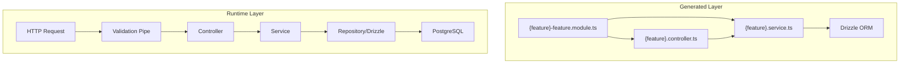
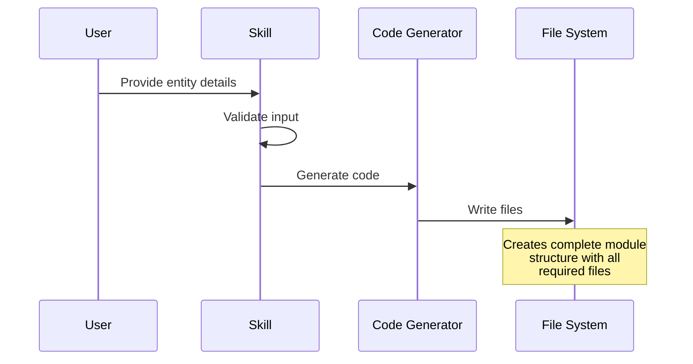
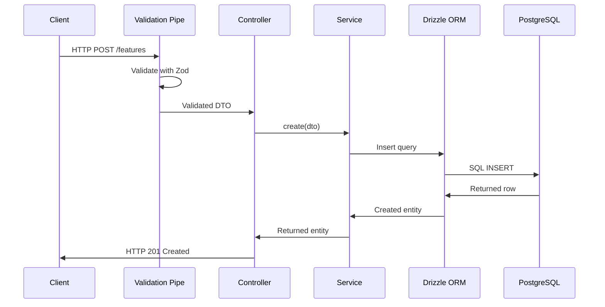

# Design Document: NestJS Drizzle CRUD Generator Skill

**Document Type**: Feature Design Specification
**Date**: 2026-02-19
**Status**: Approved for Implementation
**Author**: Design Team

---

## 1. Executive Summary

This document describes the design for a NestJS Drizzle CRUD Generator Skill that automatically generates server-side features following the layered architecture pattern established in the zaccheroni-monorepo project.

The skill enables developers to rapidly create complete CRUD (Create, Read, Update, Delete) functionality for NestJS applications using Drizzle ORM as the database abstraction layer. By providing entity name, fields, and desired operations, developers can generate fully functional, type-safe code that integrates seamlessly with the existing monorepo infrastructure.

### Key Objectives

- Reduce boilerplate code creation time for standard CRUD operations
- Ensure consistent code quality and adherence to monorepo patterns
- Provide type-safe implementations with full TypeScript support
- Generate executable unit tests alongside production code

### Expected Outcomes

- Developers can generate compilable NestJS modules in minutes
- Generated code follows established monorepo patterns exactly
- Unit tests are executable and provide meaningful coverage

---

## 2. Background

### Context

The zaccheroni-monorepo project utilizes a layered architecture pattern for NestJS server applications, integrating Drizzle ORM for database operations. Each feature requires a consistent set of files including modules, controllers, services, DTOs, and tests. This repetitive pattern presents an opportunity for automation.

### Problem Statement

Manual creation of CRUD features requires:

1. Writing boilerplate module configuration with forRootAsync pattern
2. Creating RESTful controller endpoints with proper routing
3. Implementing service methods with Drizzle query builders
4. Defining Zod validation schemas for DTOs
5. Writing unit tests with database mocking

This process is time-consuming and prone to inconsistencies across features. A generator skill can eliminate these issues while ensuring every feature follows the exact same pattern.

### Opportunity

By implementing an interactive skill that generates these components automatically, the team can:

- Standardize all CRUD feature implementations
- Reduce feature development time significantly
- Eliminate copy-paste errors and inconsistencies
- Onboard new team members more quickly

---

## 3. Requirements

### 3.1 Functional Requirements

#### FR-001: Module Generation

The skill shall generate a NestJS module with the following characteristics:

- Use of `forRootAsync` pattern for lazy configuration
- Proper dependency injection of database and config services
- Export of the generated service for consumption by other modules
- Type-safe module configuration interface

#### FR-002: Controller Generation

The skill shall generate a REST controller with:

- Full CRUD endpoints: Create, Read (single and list), Update, Delete
- Proper HTTP method decorators (GET, POST, PUT/PATCH, DELETE)
- Route parameters with type validation
- DTO integration for request body validation

#### FR-003: Service Generation

The skill shall generate a service with:

- Drizzle ORM query methods for all CRUD operations
- Proper error handling for database exceptions
- Type-safe return types matching the entity
- Support for soft delete pattern via `deleted_at` column

#### FR-004: DTO Generation

The skill shall generate DTOs with:

- Zod schemas for input validation
- Separate schemas for Create and Update operations
- Proper type inference for request/response bodies
- Integration with NestJS validation pipe

#### FR-005: Test Generation

The skill shall generate unit tests with:

- Jest test suite structure
- Mock implementation for Drizzle database operations
- Test cases for each CRUD method
- Edge case coverage (empty results, invalid UUIDs)

#### FR-006: Soft Delete Support

The skill shall support soft delete pattern:

- Automatic inclusion of `deleted_at` column in queries
- Query filtering to exclude soft-deleted records by default
- Option to include deleted records when needed

#### FR-007: Pagination and Filtering

The skill shall support pagination and filtering:

- Limit/offset based pagination
- Configurable default page size
- Filter parameters for common query scenarios

#### FR-008: Relationship Support

The skill shall support relationships with other tables:

- Foreign key field generation
- Option to include related entity data
- Support for common relationship types (one-to-many, many-to-one)

### 3.2 Non-Functional Requirements

#### NFR-001: Pattern Compliance

The generated code shall exactly follow the patterns established in the zaccheroni-monorepo, including:

- File and directory structure conventions
- Naming conventions for files, classes, and methods
- Import organization and module exports
- Error handling approaches

#### NFR-002: Type Safety

The generated code shall be fully type-safe:

- Full TypeScript type inference
- No use of `any` types
- Proper generic type implementations
- Complete IDE autocomplete support

#### NFR-003: Framework Integration

The generated code shall integrate with:

- NestJS dependency injection system
- NestJS validation pipe
- NestJS exception filters
- Drizzle ORM query builder

### 3.3 Success Criteria

| Criterion | Description | Verification |
|-----------|-------------|--------------|
| SC-001 | Generated code compiles without errors | `npm run build` passes |
| SC-002 | Generated code follows monorepo patterns | Code review |
| SC-003 | Unit tests are executable | `npm run test` passes |
| SC-004 | Generated service methods function correctly | Integration testing |

---

## 4. Architecture

### 4.1 Generated Structure

The skill generates the following directory structure for each feature:

```
libs/server/{feature-name}/
├── src/
│   ├── index.ts
│   └── lib/
│       ├── {feature}-feature.module.ts
│       ├── {feature}-feature-options.ts
│       ├── controllers/
│       │   ├── index.ts
│       │   └── {feature}.controller.ts
│       ├── services/
│       │   ├── index.ts
│       │   ├── {feature}.service.ts
│       │   └── {feature}.service.spec.ts
│       └── dto/
│           ├── index.ts
│           └── {feature}.dto.ts
├── package.json
├── project.json
├── tsconfig.lib.json
├── tsconfig.spec.json
└── jest.config.ts
```

### 4.2 Component Architecture



### 4.3 Design Decisions

| Decision | Rationale |
|----------|-----------|
| forRootAsync pattern | Enables lazy loading and configuration injection |
| Zod for validation | Type-safe validation with runtime checks |
| Soft delete default | Prevents accidental data loss |
| Page size configuration | Allows performance tuning per use case |

---

## 5. Components

### 5.1 Feature Module

The module follows NestJS best practices with async configuration:

```typescript
// {feature}-feature.module.ts
@Module({})
export class {FeatureName}FeatureModule {
  static forRootAsync(
    options: AsyncFeatureModuleOptions<{FeatureName}FeatureOptions>,
  ): DynamicModule {
    return {
      global: true,
      module: {FeatureName}FeatureModule,
      imports: [DatabaseModule.forFeature([{FeatureName}Table])],
      controllers: [{FeatureName}Controller],
      providers: [
        {
          provide: FEATURE_OPTIONS,
          useFactory: options.useFactory,
          inject: options.inject,
        },
        {FeatureName}Service,
      ],
      exports: [{FeatureName}Service],
    };
  }
}
```

### 5.2 Feature Options

Extensible configuration interface:

```typescript
// {feature}-feature-options.ts
export interface {FeatureName}FeatureOptions {
  defaultPageSize?: number;
  maxPageSize?: number;
  includeDeleted?: boolean;
}
```

### 5.3 Controller

REST endpoints with Zod validation:

```typescript
// controllers/{feature}.controller.ts
import { ZodCustomPipe } from '@your-org/server-utils';

@Controller('{feature}')
@ApiTags('{FeatureName}')
export class {FeatureName}Controller {
  constructor(private readonly service: {FeatureName}Service) {}

  @Post()
  async create(
    @Body(new ZodCustomPipe(Create{FeatureName}Schema))
    dto: Create{FeatureName}Dto
  ) {
    return this.service.create(dto);
  }

  @Get()
  async findAll(
    @Query(new ZodCustomPipe(FindAll{FeatureName}QuerySchema))
    query: FindAll{FeatureName}QueryDto
  ) {
    return this.service.findAll(query);
  }

  @Get(':id')
  async findOne(@Param('id') id: string) {
    return this.service.findOne(id);
  }

  @Patch(':id')
  async update(
    @Param('id') id: string,
    @Body(new ZodCustomPipe(Update{FeatureName}Schema))
    dto: Update{FeatureName}Dto
  ) {
    return this.service.update(id, dto);
  }

  @Delete(':id')
  async remove(@Param('id') id: string) {
    return this.service.remove(id);
  }
}
```

### 5.4 Service

Business logic with Drizzle ORM:

```typescript
// services/{feature}.service.ts
@Injectable()
export class {FeatureName}Service {
  constructor(
    @Inject(DrizzleProvider)
    private readonly db: DrizzleD1Database | DrizzlePgDatabase,
  ) {}

  async create(dto: Create{FeatureName}Dto): Promise<{FeatureName}> {
    const [created] = await this.db
      .insert({FeatureName}Table)
      .values(dto)
      .returning();
    return created;
  }

  async findAll(query: FindAll{FeatureName}QueryDto): Promise<{ rows: {FeatureName}[], total: number }> {
    const { page = 1, limit = 10, ...filters } = query;
    const offset = (page - 1) * limit;

    // Build query with filters and pagination
    // Apply soft delete filtering
    // Return paginated results
  }

  async findOne(id: string): Promise<{FeatureName} | null> {
    // Query with soft delete filter
  }

  async update(id: string, dto: Update{FeatureName}Dto): Promise<{FeatureName}> {
    // Update with soft delete awareness
  }

  async remove(id: string): Promise<void> {
    // Soft delete implementation (set deleted_at = now())
    await this.db
      .update({FeatureName}Table)
      .set({ deleted_at: new Date() })
      .where(eq({FeatureName}Table.id, id));
  }
}
```

### 5.5 DTOs with Zod Validation

```typescript
// lib/dto/{feature}.dto.ts
import { z } from 'zod';
import { createZodDto } from 'nestjs-zod/dto';

export const Create{FeatureName}Schema = z.object({
  name: z.string().min(1).max(255),
  description: z.string().optional(),
  // ... field definitions
});

export const Update{FeatureName}Schema = Create{FeatureName}Schema.partial();

export const FindAll{FeatureName}QuerySchema = z.object({
  page: z.coerce.number().int().positive().default(1),
  limit: z.coerce.number().int().positive().max(100).default(10),
  // ... filter fields
});

export type Create{FeatureName}Dto = z.infer<typeof Create{FeatureName}Schema>;
export type Update{FeatureName}Dto = z.infer<typeof Update{FeatureName}Schema>;
export type FindAll{FeatureName}QueryDto = z.infer<typeof FindAll{FeatureName}QuerySchema>;

// NestJS DTOs with Zod integration
export class Create{FeatureName}Dto extends createZodDto(Create{FeatureName}Schema) {}
export class Update{FeatureName}Dto extends createZodDto(Update{FeatureName}Schema) {}
export class FindAll{FeatureName}QueryDto extends createZodDto(FindAll{FeatureName}QuerySchema) {}
```

### 5.6 Unit Tests

```typescript
// services/{feature}.service.spec.ts
describe('{FeatureName}Service', () => {
  let service: {FeatureName}Service;
  let mockDb: jest.Mocked<DrizzlePgDatabase>;

  beforeEach(() => {
    mockDb = createMockDrizzleDatabase();
    service = new {FeatureName}Service(mockDb);
  });

  describe('create', () => {
    it('should create a new {featureName}', async () => {
      const dto = { name: 'Test' };
      mockDb.insert.mockResolvedValue({ returning: [{ id: '1', ...dto }] });

      const result = await service.create(dto);

      expect(result.name).toBe('Test');
    });
  });

  // Additional test cases...
});
```

### 5.7 Index Files

```typescript
// controllers/index.ts
export * from './{feature}.controller';

// services/index.ts
export * from './{feature}.service';

// dto/index.ts
export * from './{feature}.dto';
```

---

## 6. Data Flow

### 6.1 Generation Flow



### 6.2 Runtime Flow



### 6.3 Input Data

The skill requires the following user input:

| Input | Type | Description |
|-------|------|-------------|
| featureName | string | Name of the feature (e.g., "user", "product") |
| fields | Field[] | Array of field definitions |
| options | GenerationOptions | Optional generation settings |

---

## 7. Error Handling

### 7.1 Error Types and Responses

| Error Type | HTTP Status | Handling |
|------------|-------------|----------|
| Validation Error | 400 Bad Request | Zod validation pipe returns detailed errors |
| Not Found | 404 Not Found | Service returns null, controller handles |
| Database Error | 500 Internal Server Error | Exception propagation |
| Soft Delete | 200 OK | Updates `deleted_at` timestamp |

### 7.2 Validation Errors

Zod validation provides detailed error messages:

```json
{
  "statusCode": 400,
  "message": ["name must be a string", "name should not be empty"],
  "error": "Bad Request"
}
```

### 7.3 Not Found Handling

```typescript
async findOne(id: string): Promise<{FeatureName} | null> {
  const [result] = await this.db
    .select()
    .from({FeatureName}Table)
    .where(eq({FeatureName}Table.id, id))
    .where(isNull({FeatureName}Table.deleted_at)); // Exclude soft deleted

  if (!result) {
    return null;
  }
  return result;
}
```

---

## 8. Testing Strategy

### 8.1 Unit Test Coverage

The generated unit tests cover the following scenarios:

| Method | Test Cases |
|--------|------------|
| create | Success, validation failure, database error |
| findAll | Success with pagination, empty results, filters |
| findOne | Success, not found, invalid UUID |
| update | Success, not found, database error |
| remove | Success, not found (soft delete) |

### 8.2 Mock Strategy

```typescript
// Mock database setup
const createMockDrizzleDatabase = (): jest.Mocked<DrizzlePgDatabase> => ({
  select: jest.fn().mockReturnValue({
    from: jest.fn().mockReturnValue({
      where: jest.fn().mockReturnValue({
        returning: jest.fn().mockResolvedValue([]),
      }),
    }),
  }),
  insert: jest.fn().mockReturnValue({
    values: jest.fn().mockReturnValue({
      returning: jest.fn().mockResolvedValue([]),
    }),
  }),
  update: jest.fn().mockReturnValue({
    set: jest.fn().mockReturnValue({
      where: jest.fn().mockReturnValue({
        returning: jest.fn().mockResolvedValue([]),
      }),
    }),
  }),
  // ... other methods
} as any);
```

### 8.3 Edge Cases

| Edge Case | Expected Behavior |
|-----------|-------------------|
| Empty database | Return empty array with zero total |
| Invalid UUID format | Return null / empty array |
| Database connection failure | Throw exception |
| Maximum page size exceeded | Cap at maxPageSize |

---

## 9. Out of Scope

The following items are explicitly not within scope for this skill:

### 9.1 Excluded Features

- **Frontend React Components**: The skill focuses solely on server-side generation
- **Database Migrations**: Schema creation and migrations are managed separately
- **Integration Tests**: End-to-end testing is handled by separate tooling
- **Authentication/Authorization**: Security concerns are handled at the application level
- **Complex Business Logic**: Custom business logic must be added post-generation

### 9.2 Future Considerations

The following may be considered for future iterations:

- GraphQL API generation
- WebSocket support
- Event-driven architecture patterns
- Advanced query builders
- Multi-tenant support

---

## 10. Open Questions

The following questions require clarification before final implementation:

### 10.1 Enum Handling

**Question**: How should custom database enums be handled in generation?

**Options**:
1. Generate Zod enum from PostgreSQL enum
2. Allow manual enum definition input
3. Default to string type for simplicity

**Recommendation**: Provide manual enum definition input for flexibility.

### 10.2 Composite Foreign Keys

**Question**: Should the generator support composite foreign keys?

**Impact**: Complex query builder changes, additional UI input complexity

**Recommendation**: Exclude from v1, evaluate for future release.

### 10.3 Page Size Configuration

**Question**: Should default page size be configurable at the skill level or per-generation?

**Options**:
1. Global default with per-feature override
2. Per-generation configuration only
3. Environment-based configuration

**Recommendation**: Per-generation configuration with sensible defaults (page: 1, limit: 10).

---

## 11. Appendix

### A. File Naming Conventions

| Component | Pattern | Example |
|-----------|---------|---------|
| Module | `{feature}-feature.module.ts` | `user-feature.module.ts` |
| Options | `{feature}-feature-options.ts` | `user-feature-options.ts` |
| Controller | `{feature}.controller.ts` | `user.controller.ts` |
| Service | `{feature}.service.ts` | `user.service.ts` |
| Test | `{feature}.service.spec.ts` | `user.service.spec.ts` |
| DTO | `{feature}.dto.ts` | `user.dto.ts` |

### B. Field Type Mapping

| TypeScript Type | Zod Schema | Drizzle Type |
|-----------------|------------|--------------|
| string | z.string() | pg.text() |
| number | z.number() | pg.numeric() |
| boolean | z.boolean() | pg.boolean() |
| Date | z.date() | pg.timestamp() |
| UUID | z.string().uuid() | pg.uuid() |

### C. Dependencies

The generated code requires the following monorepo packages:

- `@nestjs/common`
- `@nestjs/core`
- `@nestjs/config`
- `drizzle-orm`
- `drizzle-zod`
- `zod`
- `@anatine/zod-nestjs`

### D. References

- [NestJS Documentation](https://docs.nestjs.com)
- [Drizzle ORM Documentation](https://orm.drizzle.team)
- [Zod Documentation](https://zod.dev)
- [zaccheroni-monorepo](https://github.com/example/zaccheroni-monorepo)

---

**Document Version**: 1.0
**Last Updated**: 2026-02-19
**Next Review**: Prior to implementation start
