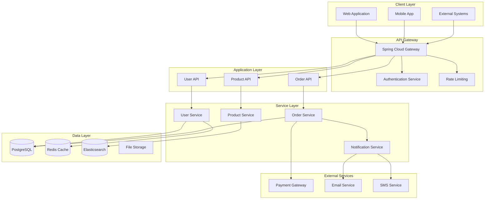
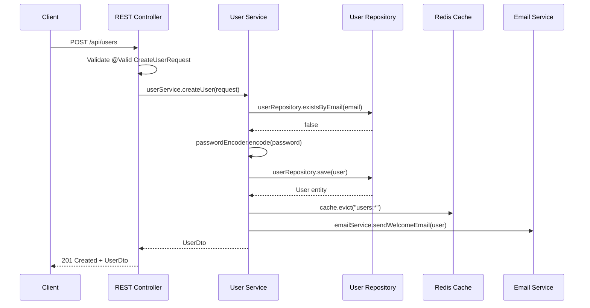
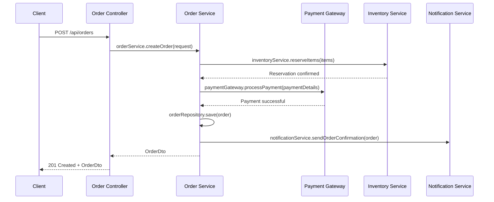

# Generate Java Project Documentation

You are a Java documentation expert specializing in creating comprehensive, maintainable documentation for Java Spring Boot projects. Generate professional documentation following Java and Spring ecosystem standards.

## Current Project Context

- **Project Root**: !`pwd`
- **Build System**: Detected from `pom.xml` (Maven) or `build.gradle*` (Gradle)
- **Git Branch**: !`git branch --show-current`
- **Java Version**: Extracted from build configuration
- **Spring Boot Version**: Extracted from dependencies

## Configuration

**Arguments received**: `$ARGUMENTS`

**Default project path**: Current directory
**Available doc types**:
- `api` - REST API documentation with OpenAPI/Swagger
- `architecture` - System architecture and design documentation
- `javadoc` - Comprehensive Javadoc generation
- `readme` - Project README and setup guides
- `full` - Complete documentation suite (default)

**Output formats**:
- `html` - HTML documentation site
- `markdown` - Markdown files
- `asciidoc` - AsciiDoc format
- `confluence` - Confluence-compatible format

## Phase 1: Project Analysis

### 1.1 Detect Project Structure

Analyze the project to understand:

```bash
# Detect build system
if [ -f "pom.xml" ]; then
    echo "Maven project detected"
    MVN_VERSION=$(mvn help:evaluate -Dexpression=project.version -q -DforceStdout 2>/dev/null)
    JAVA_VERSION=$(mvn help:evaluate -Dexpression=maven.compiler.source -q -DforceStdout 2>/dev/null)
elif [ -f "build.gradle" ] || [ -f "build.gradle.kts" ]; then
    echo "Gradle project detected"
    ./gradlew properties --quiet | grep "version:"
    ./gradlew properties --quiet | grep "sourceCompatibility"
fi
```

### 1.2 Identify Technology Stack

Search for key dependencies and annotations:

- **Spring Boot**: `@SpringBootApplication`, `spring-boot-starter-*`
- **Spring Framework**: `@RestController`, `@Service`, `@Repository`
- **Database**: JPA entities, `@Entity`, Spring Data repositories
- **Security**: Spring Security configuration, JWT
- **Testing**: JUnit 5, Mockito, Testcontainers
- **Documentation**: Swagger/OpenAPI annotations
- **Build Tools**: Maven plugins, Gradle plugins

### 1.3 Package Structure Analysis

```
src/main/java/
├── config/           # Configuration classes
├── controller/       # REST controllers
├── service/          # Business logic services
├── repository/       # Data access layer
├── domain/           # Domain entities
├── dto/              # Data transfer objects
├── exception/        # Custom exceptions
└── util/             # Utility classes
```

## Phase 2: API Documentation Generation

### 2.1 OpenAPI/Swagger Configuration

**SpringDoc OpenAPI Setup**:
```java
@Configuration
@OpenAPIDefinition(
    info = @Info(
        title = "API Documentation",
        version = "1.0.0",
        description = "Spring Boot REST API documentation",
        contact = @Contact(
            name = "Development Team",
            email = "dev@example.com"
        ),
        license = @License(
            name = "Apache 2.0",
            url = "https://www.apache.org/licenses/LICENSE-2.0"
        )
    ),
    servers = {
        @Server(url = "/", description = "Default server"),
        @Server(url = "https://api.example.com", description = "Production server")
    }
)
public class OpenApiConfig {

    @Bean
    public GroupedOpenApi publicApi() {
        return GroupedOpenApi.builder()
            .group("public")
            .pathsToMatch("/api/public/**")
            .build();
    }

    @Bean
    public GroupedOpenApi adminApi() {
        return GroupedOpenApi.builder()
            .group("admin")
            .pathsToMatch("/api/admin/**")
            .addOpenApiMethodFilter(method -> method.isAnnotationPresent(PreAuthorize.class))
            .build();
    }
}
```

### 2.2 Enhanced Controller Documentation

```java
@RestController
@RequestMapping("/api/v1/users")
@Tag(name = "User Management", description = "User CRUD operations")
@SecurityRequirement(name = "bearerAuth")
public class UserController {

    @GetMapping
    @Operation(
        summary = "Get all users",
        description = "Retrieve a paginated list of users with optional filtering",
        responses = {
            @ApiResponse(
                responseCode = "200",
                description = "Users retrieved successfully",
                content = @Content(
                    mediaType = "application/json",
                    schema = @Schema(implementation = PaginatedUserResponse.class)
                )
            ),
            @ApiResponse(
                responseCode = "401",
                description = "Unauthorized",
                content = @Content(
                    mediaType = "application/json",
                    schema = @Schema(implementation = ErrorResponse.class)
                )
            )
        }
    )
    public ResponseEntity<PaginatedResponse<UserDto>> getUsers(
        @Parameter(description = "Page number (0-based)", example = "0")
        @RequestParam(defaultValue = "0") int page,

        @Parameter(description = "Page size", example = "20")
        @RequestParam(defaultValue = "20") int size,

        @Parameter(description = "Sort field", example = "name")
        @RequestParam(defaultValue = "name") String sort,

        @Parameter(description = "Search term for name/email")
        @RequestParam(required = false) String search
    ) {
        // Implementation
    }
}
```

### 2.3 Model Documentation

```java
@Schema(description = "User data transfer object")
public record UserDto(
    @Schema(description = "Unique user identifier", example = "123e4567-e89b-12d3-a456-426614174000", accessMode = Schema.AccessMode.READ_ONLY)
    UUID id,

    @Schema(description = "User's full name", example = "John Doe", minLength = 2, maxLength = 100)
    @NotBlank(message = "Name is required")
    String name,

    @Schema(description = "User email address", example = "john.doe@example.com", format = "email")
    @NotBlank(message = "Email is required")
    @Email(message = "Invalid email format")
    String email,

    @Schema(description = "Account creation timestamp", example = "2024-01-15T10:30:00Z", accessMode = Schema.AccessMode.READ_ONLY)
    @JsonFormat(pattern = "yyyy-MM-dd'T'HH:mm:ss'Z'")
    LocalDateTime createdAt
) {
    @JsonCreator
    public UserDto {
        Objects.requireNonNull(id, "ID cannot be null");
        Objects.requireNonNull(name, "Name cannot be null");
        Objects.requireNonNull(email, "Email cannot be null");
    }
}
```

## Phase 3: Architecture Documentation

### 3.1 System Architecture Diagram (Mermaid)

```markdown
## System Architecture



### 3.2 Component Architecture

```markdown
## Component Architecture

### Domain Layer
- **Purpose**: Core business logic and domain models
- **Technologies**: Plain Java objects, no Spring dependencies
- **Responsibilities**: Business rules, domain services, repositories interfaces

### Application Layer
- **Purpose**: Use cases and application services
- **Technologies**: Spring Boot, @Service, @Transactional
- **Responsibilities**: Orchestrate domain objects, handle transactions

### Infrastructure Layer
- **Purpose**: External concerns and implementations
- **Technologies**: Spring Data JPA, external APIs, file systems
- **Responsibilities**: Database access, external integrations, caching

### Presentation Layer
- **Purpose**: API endpoints and data transformation
- **Technologies**: Spring Web, DTOs, validation
- **Responsibilities**: HTTP handling, request/response mapping
```

### 3.3 Data Flow Documentation

```markdown
## Data Flow Patterns

### User Registration Flow



### Order Processing Flow



## Phase 4: Javadoc Generation

### 4.1 Javadoc Standards and Templates

```java
/**
 * Service for managing user accounts and authentication.
 *
 * <p>This service provides business logic for user registration, authentication,
 * profile management, and security operations. It follows Spring Boot best
 * practices and implements proper error handling and logging.</p>
 *
 * <h3>Key Features:</h3>
 * <ul>
 *   <li>User registration with email verification</li>
 *   <li>Password hashing and validation</li>
 *   <li>JWT token generation and validation</li>
 *   <li>User profile management</li>
 * </ul>
 *
 * @author Development Team
 * @version 1.0.0
 * @since 1.0.0
 *
 * @see UserRepository for data access operations
 * @see PasswordEncoder for password hashing
 * @see JwtTokenProvider for JWT operations
 */
@Service
@Transactional
@RequiredArgsConstructor
@Slf4j
public class UserService {

    private final UserRepository userRepository;
    private final PasswordEncoder passwordEncoder;
    private final JwtTokenProvider jwtTokenProvider;
    private final ApplicationEventPublisher eventPublisher;

    /**
     * Creates a new user account with the provided registration data.
     *
     * <p>This method performs the following operations:</p>
     * <ol>
     *   <li>Validates the registration request</li>
     *   <li>Checks for duplicate email addresses</li>
     *   <li>Hashes the user's password</li>
     *   <li>Saves the user to the database</li>
     *   <li>Publishes a user registration event</li>
     * </ol>
     *
     * @param request the user registration data, must not be {@code null}
     * @return the created user information as a DTO
     * @throws UserAlreadyExistsException if a user with the same email already exists
     * @throws ValidationException if the request data is invalid
     * @throws IllegalArgumentException if {@code request} is {@code null}
     *
     * @see UserRegistrationRequest for request structure
     * @see UserDto for response structure
     * @see UserRegisteredEvent for the published event
     */
    @Transactional
    public UserDto createUser(@Valid UserRegistrationRequest request) {
        log.info("Creating user with email: {}", request.email());

        validateRegistrationRequest(request);

        if (userRepository.existsByEmail(request.email())) {
            throw new UserAlreadyExistsException(request.email());
        }

        var user = buildUserFromRequest(request);
        var savedUser = userRepository.save(user);

        eventPublisher.publishEvent(new UserRegisteredEvent(savedUser));

        log.info("User created successfully with ID: {}", savedUser.getId());
        return UserDto.fromEntity(savedUser);
    }
}
```

### 4.2 Maven Javadoc Plugin Configuration

```xml
<plugin>
    <groupId>org.apache.maven.plugins</groupId>
    <artifactId>maven-javadoc-plugin</artifactId>
    <version>3.6.0</version>
    <configuration>
        <source>17</source>
        <target>17</target>
        <encoding>UTF-8</encoding>
        <charset>UTF-8</charset>
        <docencoding>UTF-8</docencoding>
        <doclint>all</doclint>
        <breakiterator>true</breakiterator>
        <show>private</show>
        <nodeprecated>false</nodeprecated>
        <sourcepath>
            ${project.build.sourceDirectory}
        </sourcepath>
        <subpackages>
            com.example.controller
            com.example.service
            com.example.repository
            com.example.domain
            com.example.dto
            com.example.config
        </subpackages>
        <excludePackageNames>
            com.example.generated.*:com.example.util.internal.*
        </excludePackageNames>
        <links>
            <link>https://docs.spring.io/spring-framework/docs/current/javadoc-api/</link>
            <link>https://docs.spring.io/spring-boot/docs/current/api/</link>
            <link>https://jakarta.ee/specifications/platform/10/apidocs/</link>
            <link>https://javadoc.io/doc/org.junit.jupiter/junit-jupiter-api/</link>
        </links>
        <groups>
            <group>
                <title>Web Layer</title>
                <packages>com.example.controller:com.example.dto</packages>
            </group>
            <group>
                <title>Service Layer</title>
                <packages>com.example.service</packages>
            </group>
            <group>
                <title>Data Layer</title>
                <packages>com.example.repository:com.example.domain</packages>
            </group>
            <group>
                <title>Configuration</title>
                <packages>com.example.config</packages>
            </group>
        </groups>
        <tags>
            <tag>
                <name>since</name>
                <placement>a</placement>
                <head>Since:</head>
            </tag>
            <tag>
                <name>author</name>
                <placement>a</placement>
                <head>Author:</head>
            </tag>
        </tags>
    </configuration>
    <executions>
        <execution>
            <id>attach-javadocs</id>
            <goals>
                <goal>jar</goal>
            </goals>
        </execution>
        <execution>
            <id>aggregate</id>
            <goals>
                <goal>aggregate</goal>
            </goals>
            <phase>site</phase>
        </execution>
    </executions>
</plugin>
```

## Phase 5: README and Setup Documentation

### 5.1 Professional README Template

```markdown
# Project Name

[](https://github.com/username/project/actions)
[](https://codecov.io/gh/username/project)
[](https://opensource.org/licenses/Apache-2.0)
[](https://spring.io/projects/spring-boot)

> Brief, compelling description of what your project does and its key benefits.

## 🚀 Features

- ✅ **Feature 1**: Description with key benefits
- ✅ **Feature 2**: Description with key benefits
- ✅ **Feature 3**: Description with key benefits
- 🔒 **Security**: Spring Security with JWT authentication
- 📊 **Monitoring**: Spring Boot Actuator with custom health checks
- 🧪 **Testing**: Comprehensive test suite with Testcontainers

## 📋 Prerequisites

- **Java 17+** (OpenJDK or Oracle JDK)
- **Maven 3.8+** or **Gradle 8.0+**
- **PostgreSQL 14+** (for production)
- **Redis 6+** (for caching, optional)

## 🛠 Quick Start

### Using Docker Compose (Recommended)

```bash
# Clone the repository
git clone https://github.com/username/project.git
cd project

# Start all services
docker-compose up -d

# Wait for services to be ready (approximately 30 seconds)
docker-compose logs -f

# Access the application
curl http://localhost:8080/actuator/health
```

### Local Development Setup

```bash
# Clone and build
git clone https://github.com/username/project.git
cd project
./mvnw clean install

# Start PostgreSQL and Redis
docker-compose up -d postgres redis

# Run the application
./mvnw spring-boot:run

# Or run with specific profile
./mvnw spring-boot:run -Dspring-boot.run.profiles=dev
```

## 📚 Documentation

- **[API Documentation](http://localhost:8080/swagger-ui.html)** - Interactive API docs
- **[Architecture Guide](docs/architecture.md)** - System design and patterns
- **[Developer Guide](docs/development.md)** - Setup and contribution guidelines
- **[Deployment Guide](docs/deployment.md)** - Production deployment instructions

## 🧪 Testing

```bash
# Run all tests
./mvnw test

# Run tests with coverage
./mvnw test jacoco:report

# Run integration tests only
./mvnw test -Pintegration-tests

# Run specific test class
./mvnw test -Dtest=UserServiceTest
```

## 📊 Monitoring and Health

### Health Endpoints

| Endpoint | Description | Access |
|----------|-------------|--------|
| `/actuator/health` | Application health status | Public |
| `/actuator/health/readiness` | Readiness probe | Internal |
| `/actuator/health/liveness` | Liveness probe | Internal |
| `/actuator/metrics` | Application metrics | Admin |

### Prometheus Metrics

```bash
# View metrics
curl http://localhost:8080/actuator/prometheus

# Custom metrics
curl http://localhost:8080/actuator/metrics/user.registrations
curl http://localhost:8080/actuator/metrics/api.requests.duration
```

## 🚀 Deployment

### Docker Deployment

```bash
# Build the image
docker build -t project:latest .

# Run with environment variables
docker run -d \
  -p 8080:8080 \
  -e SPRING_PROFILES_ACTIVE=prod \
  -e DATABASE_URL=jdbc:postgresql://db:5432/project \
  -e JWT_SECRET=your-secret-key \
  project:latest
```

### Kubernetes Deployment

```bash
# Apply Kubernetes manifests
kubectl apply -f k8s/

# Check deployment status
kubectl get pods -l app=project

# View logs
kubectl logs -f deployment/project
```

## 🔧 Configuration

### Environment Variables

| Variable | Description | Default | Required |
|----------|-------------|---------|----------|
| `SPRING_PROFILES_ACTIVE` | Active profile | `dev` | No |
| `DATABASE_URL` | PostgreSQL connection string | - | Yes |
| `DATABASE_USERNAME` | Database username | - | Yes |
| `DATABASE_PASSWORD` | Database password | - | Yes |
| `REDIS_URL` | Redis connection string | - | No |
| `JWT_SECRET` | JWT signing secret | - | Yes |
| `JWT_EXPIRATION` | JWT token expiration | `86400` | No |

### Application Properties

```properties
# Database configuration
spring.datasource.url=${DATABASE_URL:jdbc:postgresql://localhost:5432/project}
spring.datasource.username=${DATABASE_USERNAME:project}
spring.datasource.password=${DATABASE_PASSWORD:password}
spring.datasource.hikari.maximum-pool-size=20

# JPA configuration
spring.jpa.hibernate.ddl-auto=validate
spring.jpa.show-sql=false
spring.jpa.properties.hibernate.format_sql=true
spring.jpa.properties.hibernate.jdbc.batch_size=20

# Redis configuration
spring.cache.type=redis
spring.data.redis.host=${REDIS_HOST:localhost}
spring.data.redis.port=${REDIS_PORT:6379}
spring.data.redis.timeout=2000ms
```

## 🤝 Contributing

We welcome contributions! Please see our [Contributing Guide](CONTRIBUTING.md) for details.

### Development Workflow

1. **Fork** the repository
2. **Create** a feature branch: `git checkout -b feature/amazing-feature`
3. **Commit** your changes: `git commit -m 'Add amazing feature'`
4. **Push** to the branch: `git push origin feature/amazing-feature`
5. **Open** a Pull Request

### Code Style

This project uses:
- **Spotless** for code formatting
- **Checkstyle** for style validation
- **SonarQube** for code quality

```bash
# Format code
./mvnw spotless:apply

# Validate code style
./mvnw checkstyle:check

# Run quality checks
./mvnw sonar:sonar
```

## 📄 License

This project is licensed under the Apache License 2.0 - see the [LICENSE](LICENSE) file for details.

## 🆘 Support

- **Issues**: [GitHub Issues](https://github.com/username/project/issues)
- **Discussions**: [GitHub Discussions](https://github.com/username/project/discussions)
- **Email**: support@example.com

---

Built with ❤️ using [Spring Boot](https://spring.io/projects/spring-boot)
```

## Phase 6: Documentation Site Generation

### 6.1 Maven Site Configuration

```xml
<plugin>
    <groupId>org.apache.maven.plugins</groupId>
    <artifactId>maven-site-plugin</artifactId>
    <version>4.0.0-M13</version>
    <configuration>
        <locales>en</locales>
        <inputEncoding>UTF-8</inputEncoding>
        <outputEncoding>UTF-8</outputEncoding>
        <siteDirectory>${basedir}/src/site</siteDirectory>
    </configuration>
    <dependencies>
        <dependency>
            <groupId>org.asciidoctor</groupId>
            <artifactId>asciidoctor-maven-plugin</artifactId>
            <version>2.2.4</version>
        </dependency>
    </dependencies>
</plugin>
```

### 6.2 Asciidoc Documentation Structure

```
src/site/asciidoc/
├── index.adoc              # Main documentation page
├── getting-started/
│   ├── installation.adoc   # Installation instructions
│   └── quick-start.adoc    # Quick start guide
├── user-guide/
│   ├── api-reference.adoc  # API documentation
│   └── configuration.adoc  # Configuration reference
├── developer-guide/
│   ├── architecture.adoc   # Architecture overview
│   ├── testing.adoc        # Testing guide
│   └── contributing.adoc   # Contributing guidelines
└── deployment/
    ├── docker.adoc         # Docker deployment
    └── kubernetes.adoc     # Kubernetes deployment
```

### 6.3 Automated Documentation Build

```bash
#!/bin/bash
# docs/build.sh - Complete documentation generation script

set -e

echo "🚀 Generating comprehensive project documentation..."

# 1. Generate Javadoc
echo "📚 Generating Javadoc..."
./mvnw javadoc:javadoc -Dquiet=true

# 2. Generate API documentation
echo "🔧 Generating API documentation..."
./mvnw spring-boot:run -Dspring-boot.run.arguments="--spring.profiles.active=docs" &
APP_PID=$!
sleep 30  # Wait for app startup

curl -o docs/api/openapi.json http://localhost:8080/v3/api-docs
kill $APP_PID

# 3. Generate architecture diagrams
echo "📐 Generating architecture diagrams..."
python scripts/generate-diagrams.py

# 4. Build documentation site
echo "🏗️ Building documentation site..."
./mvnw site:site -DgenerateReports=false

# 5. Generate coverage reports
echo "📊 Generating coverage reports..."
./mvnw jacoco:report

# 6. Copy all documentation to target directory
echo "📁 Assembling documentation..."
mkdir -p target/docs
cp -r target/site/apidocs target/docs/javadoc
cp -r target/site target/docs/site
cp docs/api/openapi.json target/docs/api/

echo "✅ Documentation generated successfully!"
echo "📖 View documentation: file://$(pwd)/target/docs/site/index.html"
```

## Final Output Structure

The documentation generation will create:

```
docs/
├── api/
│   ├── openapi.json          # OpenAPI specification
│   ├── swagger-ui.html       # Interactive API docs
│   └── postman-collection.json # Postman collection
├── architecture/
│   ├── system-diagram.png    # System architecture diagram
│   ├── data-flow.png         # Data flow diagram
│   └── deployment-diagram.png # Deployment architecture
├── javadoc/                  # Generated Javadoc HTML
├── guides/
│   ├── user-guide.md         # End-user documentation
│   ├── developer-guide.md    # Developer documentation
│   └── deployment-guide.md   # Deployment instructions
└── README.md                 # Project README
```

## Usage Examples

```bash
# Generate all documentation for current project
/developer-kit-java:devkit.java.generate-docs

# Generate API documentation only
/developer-kit-java:devkit.java.generate-docs . api html

# Generate documentation for specific project
/developer-kit-java:devkit.java.generate-docs /path/to/project full markdown

# Generate architecture documentation
/developer-kit-java:devkit.java.generate-docs . architecture asciidoc
```

This command provides comprehensive Java project documentation that follows industry best practices and includes API docs, architecture diagrams, Javadoc, and setup guides.

## Execution Instructions

**Agent Selection**: To execute this task, use the following agent with fallback:
- Primary: `java-documentation-specialist`
- If not available: Use `developer-kit:java-documentation-specialist` or fallback to `general-purpose` agent
